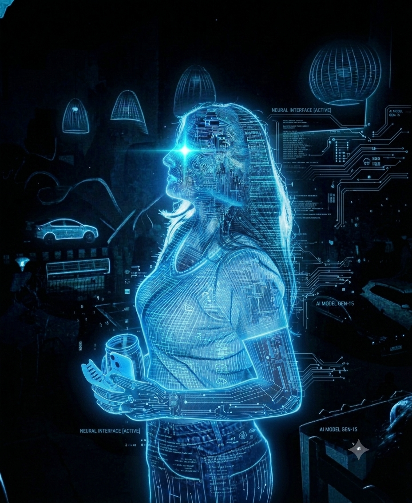

<!-- ═══════════════════════════════════════════════════════════════ -->
<!-- HEADER — ANIMATED TYPING -->
<!-- ═══════════════════════════════════════════════════════════════ -->

<div align="center">


<br>


</div>

<br>

<!-- ═══════════════════════════════════════════════════════════════ -->
<!-- HERO SECTION — PROFILE IMAGE (LEFT) + INFO CARD (RIGHT) -->
<!-- ═══════════════════════════════════════════════════════════════ -->

<table>
<tr>

<!-- LEFT — PROFILE IMAGE -->
<td width="38%" align="center" valign="middle">



<br>

```
◈ NEURAL INTERFACE [ACTIVE] ◈
◈   AI MODEL GEN-15         ◈
```

</td>

<!-- RIGHT — PERSONAL DETAILS -->
<td width="62%" valign="top">

<h1>⟨ KHUSHI MALIK ⟩</h1>
<h3>S O F T W A R E &nbsp; E N G I N E E R</h3>
<p><strong>Full Stack Developer • Backend Engineer • Cloud Enthusiast</strong></p>

<table>
<tr><td>👤 <strong>ROLE</strong></td><td><code>::</code></td><td>Software Engineer</td></tr>
<tr><td>🎓 <strong>EDUCATION</strong></td><td><code>::</code></td><td>B.Tech CSE (Full Stack AI) @ UPES</td></tr>
<tr><td>📊 <strong>CGPA</strong></td><td><code>::</code></td><td>8.8 / 10</td></tr>
<tr><td>⏱️ <strong>EXPERIENCE</strong></td><td><code>::</code></td><td>&lt; 1 yr (Internship)</td></tr>
<tr><td>💼 <strong>CURRENT ROLE</strong></td><td><code>::</code></td><td>Frontend Dev Intern @ Anantixia</td></tr>
<tr><td>📍 <strong>LOCATION</strong></td><td><code>::</code></td><td>India 🇮🇳</td></tr>
<tr><td>&lt;/&gt; <strong>LANGUAGES</strong></td><td><code>::</code></td><td>C, C++, Java, JavaScript, TypeScript, SQL</td></tr>
<tr><td>🎯 <strong>FOCUS</strong></td><td><code>::</code></td><td>Building Scalable &amp; Impactful Solutions</td></tr>
<tr><td>✅ <strong>AVAILABILITY</strong></td><td><code>::</code></td><td>Open to Opportunities</td></tr>
</table>

<div>

[](mailto:khushimalik0711@gmail.com)
&nbsp;
[](https://www.linkedin.com/in/khushi-malik-587250286/)
&nbsp;
[](https://github.com/khushimalik04)

</div>

</td>

</tr>
</table>

<br>

<!-- ═══════════════════════════════════════════════════════════════ -->
<!-- TECH STACK — COLUMNAR GRID LAYOUT -->
<!-- ═══════════════════════════════════════════════════════════════ -->

<div align="center">

```
╔══════════════════════════════════════════════════════════════════════════╗
║                         T E C H   S T A C K                            ║
║                   Tools & Technologies I Work With                      ║
╚══════════════════════════════════════════════════════════════════════════╝
```

</div>

<table align="center">
<tr>
<th align="center">⌈ LANGUAGES ⌉</th>
<th align="center">⌈ FRONTEND ⌉</th>
<th align="center">⌈ BACKEND ⌉</th>
<th align="center">⌈ DATABASE ⌉</th>
<th align="center">⌈ TOOLS ⌉</th>
<th align="center">⌈ CLOUD & DEVOPS ⌉</th>
</tr>
<tr>
<td align="left" valign="top">

 &nbsp; C <br>
 &nbsp; C++ <br>
 &nbsp; Java <br>
 &nbsp; JavaScript <br>
 &nbsp; TypeScript <br>
 &nbsp; SQL

</td>
<td align="left" valign="top">

 &nbsp; HTML <br>
 &nbsp; CSS <br>
 &nbsp; React <br>
 &nbsp; Next.js <br>
 &nbsp; Tailwind CSS <br>

</td>
<td align="left" valign="top">

 &nbsp; Node.js <br>
 &nbsp; Express.js <br>
🔗 &nbsp; REST API <br>
 &nbsp; Prisma <br>

</td>
<td align="left" valign="top">

 &nbsp; MySQL <br>
 &nbsp; MongoDB <br>
 &nbsp; PostgreSQL <br>
 &nbsp; Redis <br>

</td>
<td align="left" valign="top">

 &nbsp; Git <br>
 &nbsp; GitHub <br>
 &nbsp; VS Code <br>
 &nbsp; Postman <br>
 &nbsp; Figma <br>

</td>
<td align="left" valign="top">

 &nbsp; AWS <br>
 &nbsp; Docker <br>
 &nbsp; Kubernetes <br>
 &nbsp; Azure DevOps <br>

</td>
</tr>
</table>

<br>

<!-- ═══════════════════════════════════════════════════════════════ -->
<!-- EXPERIENCE SECTION -->
<!-- ═══════════════════════════════════════════════════════════════ -->

<div align="center">

```
╔══════════════════════════════════════════════════════════════════════════╗
║                       E X P E R I E N C E                               ║
╚══════════════════════════════════════════════════════════════════════════╝
```

</div>

<table align="center">
<tr>
<td width="33%" valign="top">

### 💼 Frontend Developer Intern
**Anantixia** &nbsp; · &nbsp; `Mar 2026 → Present`

- Developed responsive and reusable UI components using **React, TypeScript & Tailwind CSS**
- Integrated **REST APIs** and managed state using React hooks
- Collaborated with the team to build and ship features

</td>
<td width="33%" valign="top">

### 💼 Full Stack Intern
**FlashFire** &nbsp; · &nbsp; `Aug 2025 → Oct 2025`

- Built full-stack features with **Node.js, Express & MongoDB**
- Developed responsive frontend interfaces
- Worked on API development and database design

</td>
<td width="33%" valign="top">

### 💼 Full Stack Intern
**Origin CoreTech, Gurugram** &nbsp; · &nbsp; `Jun 2025 → Aug 2025`

- Built production-grade web applications
- Worked on **backend APIs** and **database architecture**
- Gained hands-on experience with deployment workflows

</td>
</tr>
</table>

<br>

<!-- ═══════════════════════════════════════════════════════════════ -->
<!-- BOTTOM GRID: ACHIEVEMENTS + PROJECTS + CONTACT -->
<!-- ═══════════════════════════════════════════════════════════════ -->

<table align="center">
<tr>

<!-- ACHIEVEMENTS (LEFT) -->
<td width="30%" valign="top">

<div align="center">

```
╔════════════════════════╗
║    ACHIEVEMENTS        ║
╚════════════════════════╝
```

</div>

⭐ **Consistent Learner** <br>
Consistently upskilling in Full Stack Development and exploring new technologies.

<br>

🧠 **Problem Solver** <br>
Actively solve DSA problems on LeetCode to improve logic and coding skills.

<br>

🚀 **Project Builder** <br>
Built and deployed multiple full stack projects from scratch.

<br>

🏆 **CTRL+SPACE Hackathon Winner** <br>
Won a national-level competitive hackathon.

<br>

🎾 **National Lawn Tennis** <br>
🏀 **State Level Basketball**

</td>

<!-- PROJECTS (CENTER) -->
<td width="40%" valign="top">

<div align="center">

```
╔══════════════════════════════╗
║         PROJECTS             ║
╚══════════════════════════════╝
```

</div>

**🤖 AI Chatbot for Businesses** <br>
Full-stack AI chatbot with real-time messaging, booking & admin dashboard. Handled 1K+ interactions at 200ms latency. <br>
`Next.js` `React` `TypeScript` `Prisma` `PostgreSQL` `OpenAI` `Stripe`

<br>

**💬 Real-Time Chat & Video App** <br>
Real-time messaging & video calling with WebRTC + Stream SDK. Secure REST APIs with RBAC. <br>
`MERN` `WebRTC` `Stream SDK` `Docker` `TanStack Query`

<br>

**📚 AI-Powered LMS** <br>
Role-based LMS with AI Tutor, course management, assignments, quizzes & attendance system. <br>
`React` `TypeScript` `Node.js` `Express` `LocalStorage`

</td>

<!-- CONTACT (RIGHT) -->
<td width="30%" valign="top">

<div align="center">

```
╔════════════════════════╗
║        CONTACT         ║
╚════════════════════════╝
```

</div>

📧 **EMAIL** <br>
khushimalik0711@gmail.com

<br>

💼 **LINKEDIN** <br>
[linkedin.com/in/khushi-malik-587250286](https://www.linkedin.com/in/khushi-malik-587250286/)

<br>

🐙 **GITHUB** <br>
[github.com/khushimalik04](https://github.com/khushimalik04)

<br>

📍 **LOCATION** <br>
India 🇮🇳

<br>

```
EXPERIENCE :: < 1 yr
STATUS     :: Open to
               Opportunities ✅
```

</td>

</tr>
</table>

<br>

<!-- ═══════════════════════════════════════════════════════════════ -->
<!-- GITHUB STATS -->
<!-- ═══════════════════════════════════════════════════════════════ -->

<div align="center">

```
╔══════════════════════════════════════════════════════════════════════════╗
║                    S Y S T E M   A N A L Y T I C S                      ║
╚══════════════════════════════════════════════════════════════════════════╝
```

<br>


&nbsp;&nbsp;


<br><br>


<br><br>


</div>

<br>

<!-- ═══════════════════════════════════════════════════════════════ -->
<!-- FOOTER -->
<!-- ═══════════════════════════════════════════════════════════════ -->

<div align="center">


</div>

<!-- ═══════════════════════════════════════════════════════════════ -->
<!-- END OF TRANSMISSION -->
<!-- ═══════════════════════════════════════════════════════════════ -->
